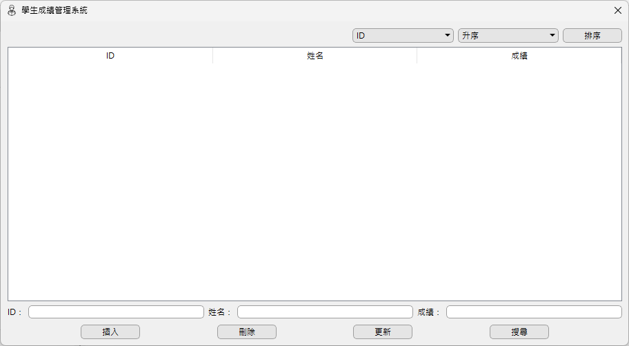
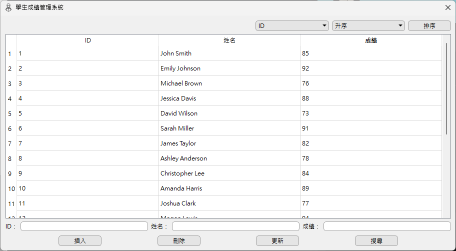
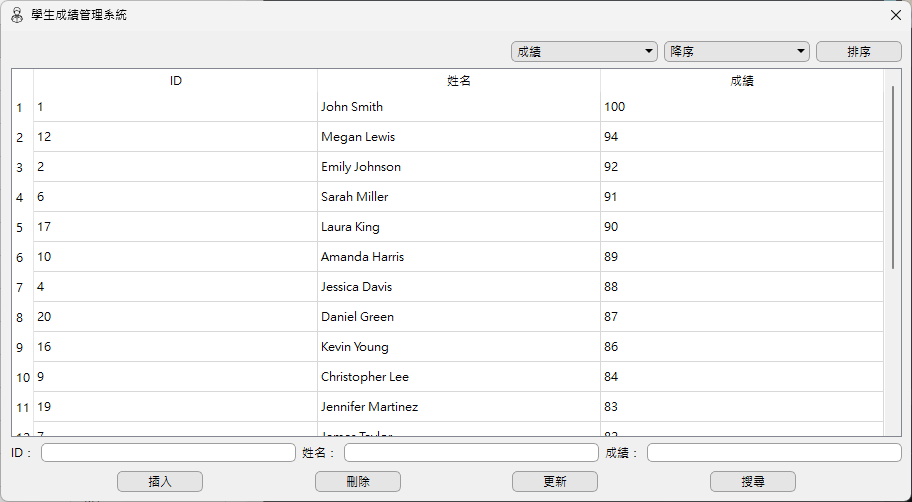
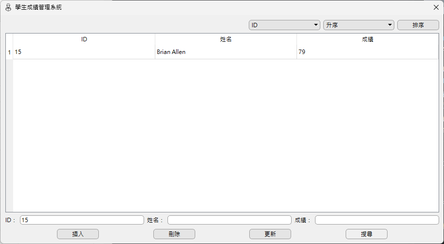
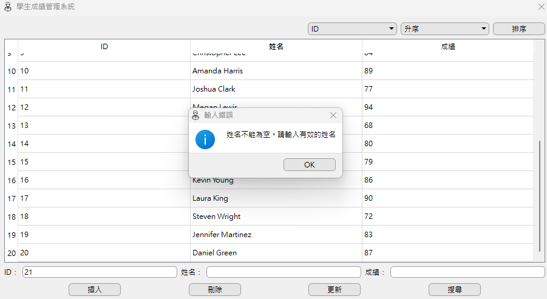
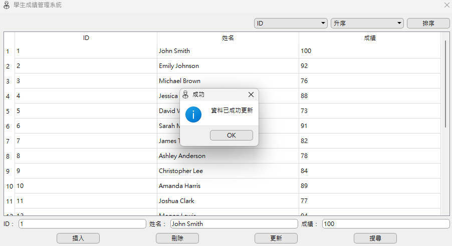

# 學生成績管理系統 📚

此專案於 2023 年 9 月製作

「學生成績管理系統」是一個用於管理學生成績的桌面應用程式，使用者可以透過此系統新增、刪除、更新和查詢來管理學生成績。

## 專案截圖 🖥

### 起始畫面

### 新增資料

### 成績降序排序

### 查詢資料

### 錯誤提示訊息

### 資料已更新提示訊息

## 使用技術 🔧

- **C++**：負責應用程式的邏輯撰寫
- **Qt**：建立應用程式的圖形介面
- **CSS**：設計應用程式的樣式
- **SQLite**：儲存和管理學生資料
- **防止 SQL Injection**：使用 `prepare` 與 `bindValue` 防止 SQL Injection

## 功能 🚀

- **新增資料**：新增學生 ID、姓名和成績
- **刪除資料**：刪除指定 ID 的學生資料
- **更新資料**：更新學生的姓名和成績
- **查詢資料**：根據 ID 查詢單一學生資料
- **排序資料**：可以根據 ID 或成績進行升序或降序排序
- **資料庫管理**：建立、維護和管理 SQLite 資料庫

## 執行方式 🏃

1. `git clone` 此專案至本機
2. 使用 Qt Creator 開啟專案
3. 點擊 `Build` 按鈕編譯應用程式
4. 點擊 `Run` 按鈕運行應用程式

## 圖示來源 🌟

[Student icons created by Eucalyp - Flaticon](https://www.flaticon.com/free-icons/student)

[Menu icons created by Google - Flaticon](https://www.flaticon.com/free-icons/menu)
